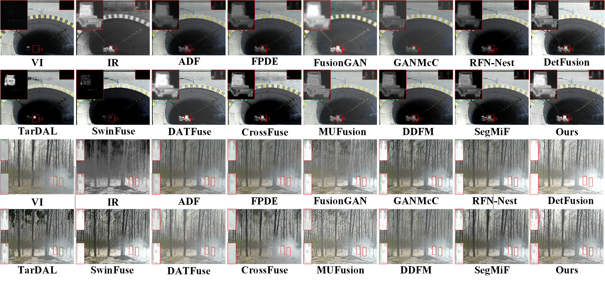
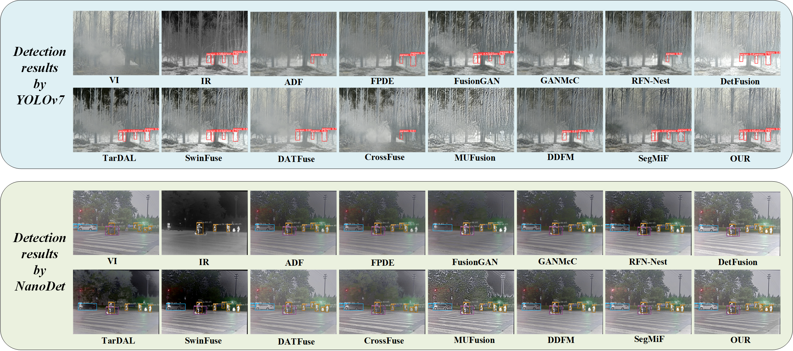

# TACFusion
This is the code for the paper：Target-aware Infrared and Visible Image Fusion Network via Co-encoding and United Optimization.

## Test
Download the model package `Epoch60.pkl` from Baidu Cloud Drive at `https://pan.baidu.com/s/13rejKAdukxT147-GmBsAMw?pwd=yc00` with `CODE: yc00` and place it in the root directory.

`python Test.py`

## Train
`python Train.py`

## Usage
Some CUDA operators here may need to be recompiled, `cd src` or ` cd DCN`,
use command `python setup.py install` or `python setup.py develop` to compile the CUDA operators. 

### Qualitative fusion results.

### Qualitative detection results.

